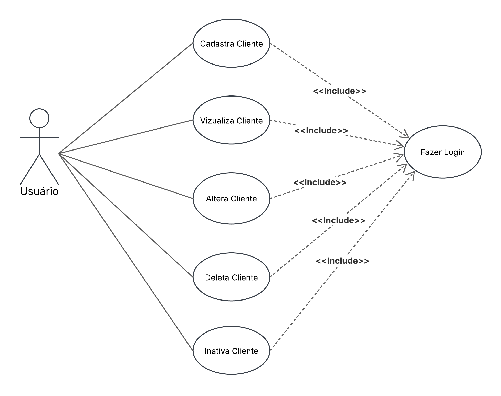
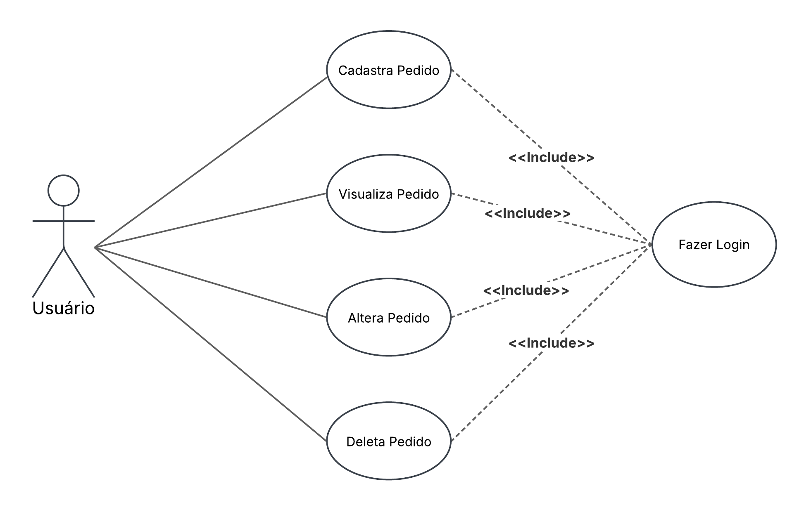

# Casos de Usos

## Casos Cliente

**1. Introdução:** Este documento descreve o diagrama de caso de uso do sistema de gerenciamento de clientes, detalhando os atores envolvidos, os casos de uso e suas relações.

**2. Atores:** Usuário.

**3. Pré-condições:** Usuário deve está logado no sistema.

## 4. Casos de Uso
## 4.1 Cadastrar cliente
**Descrição:** Permite ao usuário cadastrar um novo cliente no sistema.

### Fluxo Principal:
- **4.1.1** Usuário clica em clientes.
- **4.1.2** Sistema abre área de clientes.
- **4.1.3** Usuário clica no botão de cadastro de cliente.
- **4.1.4** Sistema apresenta um formulário para preenchimento dos dados do cliente. 
- **4.1.5** Usuário preenche dados do cliente e clica em "cadastrar".
- **4.1.6** Sistema exibe mensagem de cadastro concluído.

### Fluxos Alternativos:
- **4.1.4a** Caso algum campo obrigatório não seja preenchido, o sistema informa o erro e permite o preenchimento.

### Fluxos de Exceção:
- **4.1.5e** Se ocorrer um erro interno no sistema, ele exibe uma mensagem de falha e orienta o usuário a tentar novamente.

### Pós-condições:
- O cliente é cadastrado no sistema.
- Os dados do novo cliente ficam disponíveis para consulta e edição.

## 4.2 Visualizar Cliente

**Descrição:** Permite ao usuário visualizar os dados dos clientes cadastrados.

### Fluxo Principal:
- **4.2.1** Usuário clica em clientes.
- **4.2.2** Sistema exibe a lista de clientes cadastrados.
- **4.2.3** Usuário seleciona um cliente para visualizar seus dados.
- **4.2.4** Sistema exibe as informações detalhadas do cliente.

### Fluxos de Exceção:

- **4.2.2e** Caso não existam clientes cadastrados, o sistema informa ao usuário.

### Pós-condições:
-  O usuário visualiza os dados do cliente solicitado.

## 4.3 Alterar Cliente

**Descrição:** Permite ao usuário modificar os dados de um cliente existente.

### Fluxo Principal:
- **4.3.1** Usuário clica em clientes.
- **4.3.2** Sistema exibe a lista de clientes.
- **4.3.3** Usuário seleciona um cliente para editar.
- **4.3.4** Sistema exibe o formulário com os dados do cliente.
- **4.3.5** Usuário altera os dados desejados e clica em "confirma".
- **4.3.6** Sistema valida e confirma a atualização.

### Fluxos Alternativos:
- **4.3.5a** Caso o usuário não informe dados obrigatórios, o sistema exibe uma mensagem de erro e solicita correção.

### Fluxos de Exceção:
- **4.3.6e** Se ocorrer um erro na atualização, o sistema informa a falha e mantém os dados inalterados.

### Pós-condições:
- O cliente tem seus dados atualizados no sistema.

## 4.4 Deletar Cliente

**Descrição:** Permite ao usuário deletar um cliente do sistema.

### Fluxo Principal:
- **4.4.1** Usuário clica em clientes.
- **4.4.2** Sistema exibe a lista de clientes.
- **4.4.3** Usuário seleciona um cliente e clica em "Excluir".
- **4.4.4** Sistema solicita confirmação da exclusão.
- **4.4.5** Usuário confirma a exclusão.
- **4.4.6** Sistema exclui o cliente.

### Fluxos de Exceção:
- **4.4.6e** Se ocorrer um erro ao excluir, o sistema informa a falha e não remove o cliente.

### Pós-condições:
- O cliente é removido do sistema.

## 4.5 Desativar Cliente

**Descrição:** Permite ao usuário alterar o status do cliente para inativo, sem removê-lo do sistema.

### Fluxo Principal:
- **4.5.1** Usuário clica em clientes.
- **4.5.2** Sistema exibe a lista de clientes.
- **4.5.3** Usuário seleciona um cliente para desativar.
- **4.5.4** Sistema altera o status do cliente para inativo.

### Pós-condições:
- O cliente fica com status de inativo.

## Casos Pedido

**1. Introdução:** Este documento descreve o diagrama de caso de uso do sistema de gerenciamento de pedidos, detalhando os atores envolvidos, os casos de uso e suas relações.

**2. Atores:** Usuário.

**3. Pré-condições:** Usuário deve está logado no sistema.

## 4. Casos de uso
## 4.1 Cadastrar Pedido
**Descrição:** Permite ao usuário cadastrar um novo pedido no sistema.

### Fluxo Principal:
- **4.1.1** Usuário clica em pedidos.
- **4.1.2** Sistema abre área de pedidos.
- **4.1.3** Usuário clica no botão de cadastro de pedidos.
- **4.1.4** Sistema apresenta um formulário para preenchimento dos dados do pedido. 
- **4.1.5** Usuário preenche dados do pedido e clica em "cadastrar".
- **4.1.6** Sistema exibe mensagem de cadastro concluído.

### Fluxos Alternativos:
- **4.1.4a** Caso algum campo obrigatório não seja preenchido, o sistema informa o erro e permite o preenchimento.

### Fluxos de Exceção:
- **4.1.5e** Se ocorrer um erro interno no sistema, ele exibe uma mensagem de falha e orienta o usuário a tentar novamente.

### Pós-condições:
- O pedido é cadastrado no sistema.
- Os dados do novo pedido ficam disponíveis para consulta e edição.

## 4.2 Visualizar Pedido
**Descrição:** Permite ao usuário visualizar os dados dos pedidos cadastrados.

### Fluxo Principal:
- **4.2.1** Usuário clica em pedidos.
- **4.2.2** Sistema exibe a lista de pedidos cadastrados.
- **4.2.3** Usuário seleciona um pedido para visualizar seus dados.
- **4.2.4** Sistema exibe as informações detalhadas do pedido.

### Fluxos de Exceção:

- **4.2.2e** Caso não existam pedidos cadastrados, o sistema informa ao usuário.

### Pós-condições:
-  O usuário visualiza os dados do pedido solicitado.

## 4.3 Alterar Pedido
**Descrição:** Permite ao usuário modificar os dados de um pedido existente.

### Fluxo Principal:
- **4.3.1** Usuário clica em pedidos.
- **4.3.2** Sistema exibe a lista de pedidos.
- **4.3.3** Usuário seleciona um pedido para editar.
- **4.3.4** Sistema exibe o formulário com os dados do pedido.
- **4.3.5** Usuário altera os dados desejados e clica em "Salvar".
- **4.3.6** Sistema valida e confirma a atualização.

### Fluxos Alternativos:
- **4.3.5a** Caso o usuário não informe dados obrigatórios, o sistema exibe uma mensagem de erro e solicita correção.

### Fluxos de Exceção:
- **4.3.6e** Se ocorrer um erro na atualização, o sistema informa a falha e mantém os dados inalterados.

### Pós-condições:
- O pedido tem seus dados atualizados no sistema.

## 4.4 Deletar Pedido

**Descrição:** Permite ao usuário deletar um pedido do sistema.

### Fluxo Principal:
- **4.4.1** Usuário clica em pedidos.
- **4.4.2** Sistema exibe a lista de pedidos.
- **4.4.3** Usuário seleciona um pedido e clica em "Excluir".
- **4.4.4** Sistema solicita confirmação da exclusão.
- **4.4.5** Usuário confirma a exclusão.
- **4.4.6** Sistema exclui o pedido.

### Fluxos de Exceção:
- **4.4.6e** Se ocorrer um erro ao excluir, o sistema informa a falha e não remove o cliente.

### Pós-condições:
- O pedido é removido do sistema.
