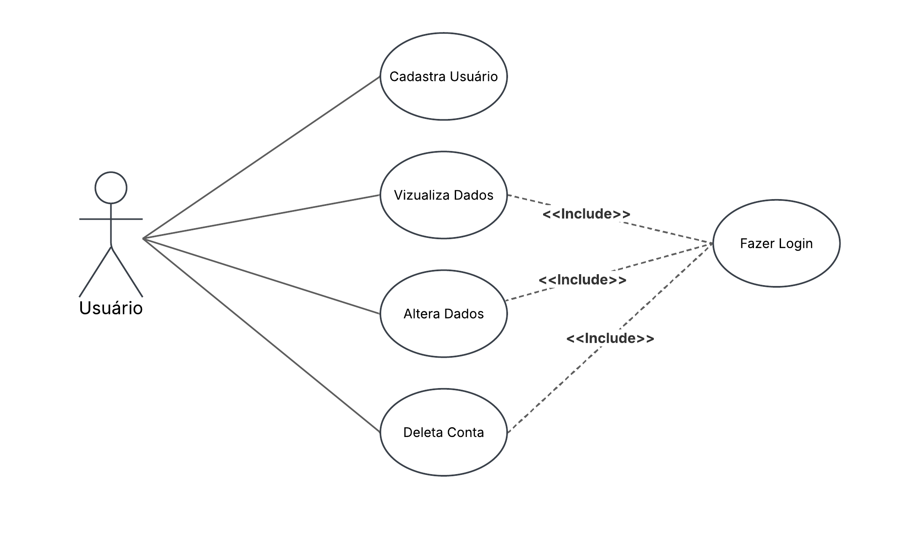
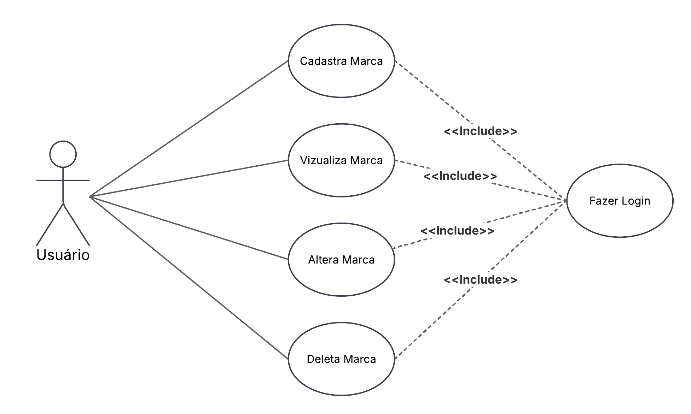
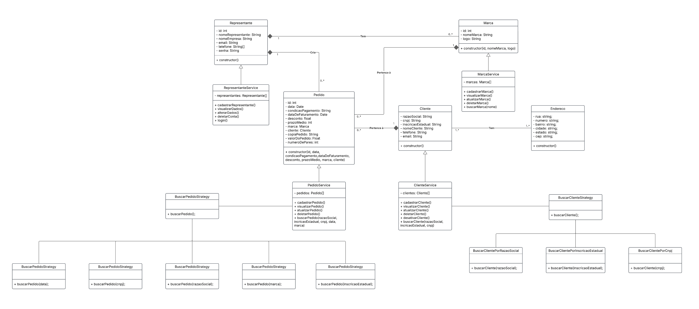

# Documentação RepHub

## Sumário

- [Casos Usuário](#casos-usuário)
    - [Cadastrar Usuário](#31-cadastrar-usuário)
    - [Visualizar Dados](#32-visualizar-dados)
    - [Alterar Dados](#33-alterar-dados)
    - [Deletar Usuário](#34-deletar-usuário)
- [Casos Marca](#casos-marca)
    - [Cadastrar Marca](#41-cadastrar-marca)
    - [Visualizar Marca](#42-visualizar-marca)
    - [Alterar Marca](#43-alterar-marca)
    - [Deletar Marca](#44-deletar-marca)
- [Casos Cliente](#casos-cliente)
    - [Cadastrar Cliente](#41-cadastrar-cliente)
    - [Visualizar Cliente](#42-visualizar-cliente)
    - [Alterar Cliente](#43-alterar-cliente)
    - [Deletar Cliente](#44-deletar-cliente)
    - [Desativar Cliente](#45-desativar-cliente)
- [Casos Pedido](#casos-pedido)
    - [Cadastrar Pedido](#41-cadastrar-pedido)
    - [Visualizar Pedido](#42-visualizar-pedido)
    - [Alterar Pedido](#43-alterar-pedido)
    - [Deletar Pedido](#44-deletar-pedido)
- [Diagrama de Classes](#diagrama-de-classes)
 

## Casos Usuário

**1. Introdução:** Este documento descreve o diagrama de caso de uso do sistema de gerenciamento de usuários, detalhando os atores envolvidos, os casos de uso e suas relações.

**2. Atores:** Usuário.

## 3. Casos de Uso
## 3.1 Cadastrar Usuário
**Descrição:** Permite ao usuário cadastrar-se no sistema.

### Fluxo Principal:
- **3.1.1** Usuário clica cadastre-se.
- **3.1.2** Sistema abre formulário de cadastro.
- **3.1.3** Usuário preenche formulário e clica no botão de ""cadastrar"".
- **3.1.4** Sistema exibe mensagem de cadastro concluído.

### Fluxos Alternativos:
- **3.1.3a** Caso algum campo obrigatório não seja preenchido, o sistema informa o erro e permite o preenchimento.

### Fluxos de Exceção:
- **4.1.4e** Se ocorrer um erro interno no sistema, ele exibe uma mensagem de falha e orienta o usuário a tentar novamente.

### Pós-condições:
- O usuário é cadastrado no sistema.

## 3.2 Visualizar Dados
**Pré-condições:** Usuário deve está logado no sistema.

**Descrição:** Permite ao usuário visualizar os seus dados cadastrados.

### Fluxo Principal:
- **3.2.1** Usuário clica em "Perfil".
- **3.2.2** Sistema exibe o formulário com os dados cadastradas do usuário.

### Pós-condições:
-  O usuário visualiza os seus dados cadastrados.

## 3.3 Alterar Dados

**Descrição:** Permite ao usuário modificar os seus dados.

### Fluxo Principal:
- **3.3.1** Usuário clica em "Perfil".
- **3.3.2** Sistema exibe o formulário com os dados cadastrados do usuário.
- **3.3.3** Usuário altera os dados desejados e clica em "Salvar".
- **3.3.4** Sistema valida e confirma a atualização.

### Fluxos Alternativos:
- **3.3.3a** Caso o usuário não informe dados obrigatórios, o sistema exibe uma mensagem de erro e solicita preenchimento.

### Fluxos de Exceção:
- **3.3.3e** Se ocorrer um erro na atualização, o sistema informa a falha e mantém os dados inalterados.

### Pós-condições:
- O usuário tem seus dados atualizados no sistema.

## 3.4 Deletar Usuário
**Descrição:** Permite ao usuário deletar a sua conta do sistema.

### Fluxo Principal:
- **3.4.1** Usuário clica em "Perfil".
- **3.4.2** Sistema exibe o formulário com os dados cadastrados do usuário.
- **3.4.3** Usuário clica no botão "Excluir conta".
- **3.4.4** Sistema solicita confirmação da exclusão.
- **3.4.5** Usuário confirma a exclusão.
- **3.4.6** Sistema exclui usuário.

### Fluxos de Exceção:
- **3.4.6e** Se ocorrer um erro ao excluir, o sistema informa a falha e não exclui usuário.

### Pós-condições:
- O usuário é excluido do sistema.

## Casos Marca

**1. Introdução:** Este documento descreve o diagrama de caso de uso do sistema de gerenciamento de marcas, detalhando os atores envolvidos, os casos de uso e suas relações.

**2. Atores:** Usuário.

**3. Pré-condições:** Usuário deve está logado no sistema.

## 4. Casos de Uso
## 4.1 Cadastrar Marca
**Descrição:** Permite ao usuário cadastrar uma nova marca no sistema.

### Fluxo Principal:
- **4.1.1** Usuário clica em marcas.
- **4.1.2** Sistema abre área de marcas.
- **4.1.3** Usuário clica no botão de cadastro de marcas.
- **4.1.4** Sistema apresenta um formulário para preenchimento dos dados da marca. 
- **4.1.5** Usuário preenche dados da marca e clica em "cadastrar".
- **4.1.6** Sistema exibe mensagem de cadastro concluído.

### Fluxos Alternativos:
- **4.1.4a** Caso algum campo obrigatório não seja preenchido, o sistema informa o erro e permite o preenchimento.

### Fluxos de Exceção:
- **4.1.5e** Se ocorrer um erro interno no sistema, ele exibe uma mensagem de falha e orienta o usuário a tentar novamente.

### Pós-condições:
- A marca é cadastrado no sistema.
- Os dados da nova marca ficam disponíveis para consulta e edição.

## 4.2 Visualizar Marca

**Descrição:** Permite ao usuário visualizar os dados das marcas cadastradas.

### Fluxo Principal:
- **4.2.1** Usuário clica em marcas.
- **4.2.2** Sistema exibe a lista de marcas cadastradas.
- **4.2.3** Usuário seleciona uma marca para visualizar seus dados.
- **4.2.4** Sistema exibe as informações detalhadas da marca.

### Fluxos de Exceção:

- **4.2.2e** Caso não existam marcas cadastrados, o sistema informa ao usuário.

### Pós-condições:
-  O usuário visualiza os dados da marca solicitada.

## 4.3 Alterar Marca

**Descrição:** Permite ao usuário modificar os dados de uma marca existente.

### Fluxo Principal:
- **4.3.1** Usuário clica em marcas.
- **4.3.2** Sistema exibe a lista de marcas.
- **4.3.3** Usuário seleciona uma marca para editar.
- **4.3.4** Sistema exibe o formulário com os dados da marca.
- **4.3.5** Usuário altera os dados desejados e clica em "confirma".
- **4.3.6** Sistema valida e confirma a atualização.

### Fluxos Alternativos:
- **4.3.5a** Caso o usuário não informe dados obrigatórios, o sistema exibe uma mensagem de erro e solicita correção.

### Fluxos de Exceção:
- **4.3.6e** Se ocorrer um erro na atualização, o sistema informa a falha e mantém os dados inalterados.

### Pós-condições:
- A marca tem seus dados atualizados no sistema.

## 4.4 Deletar Marca

**Descrição:** Permite ao usuário deletar uma marca do sistema.

### Fluxo Principal:
- **4.4.1** Usuário clica em marcas.
- **4.4.2** Sistema exibe a lista de marcas.
- **4.4.3** Usuário seleciona uma marca e clica em "Excluir".
- **4.4.4** Sistema solicita confirmação da exclusão.
- **4.4.5** Usuário confirma a exclusão.
- **4.4.6** Sistema exclui a marca.

### Fluxos de Exceção:
- **4.4.6e** Se ocorrer um erro ao excluir, o sistema informa a falha e não remove a marca.

### Pós-condições:
- A marca é removida do sistema.

## Casos Cliente

**1. Introdução:** Este documento descreve o diagrama de caso de uso do sistema de gerenciamento de clientes, detalhando os atores envolvidos, os casos de uso e suas relações.

**2. Atores:** Usuário.

**3. Pré-condições:** Usuário deve está logado no sistema.

## 4. Casos de Uso
## 4.1 Cadastrar Cliente
**Descrição:** Permite ao usuário cadastrar um novo cliente no sistema.

### Fluxo Principal:
- **4.1.1** Usuário clica em clientes.
- **4.1.2** Sistema abre área de clientes.
- **4.1.3** Usuário clica no botão de cadastro de cliente.
- **4.1.4** Sistema apresenta um formulário para preenchimento dos dados do cliente. 
- **4.1.5** Usuário preenche dados do cliente e clica em "cadastrar".
- **4.1.6** Sistema exibe mensagem de cadastro concluído.

### Fluxos Alternativos:
- **4.1.4a** Caso algum campo obrigatório não seja preenchido, o sistema informa o erro e permite o preenchimento.

### Fluxos de Exceção:
- **4.1.5e** Se ocorrer um erro interno no sistema, ele exibe uma mensagem de falha e orienta o usuário a tentar novamente.

### Pós-condições:
- O cliente é cadastrado no sistema.
- Os dados do novo cliente ficam disponíveis para consulta e edição.

## 4.2 Visualizar Cliente

**Descrição:** Permite ao usuário visualizar os dados dos clientes cadastrados.

### Fluxo Principal:
- **4.2.1** Usuário clica em clientes.
- **4.2.2** Sistema exibe a lista de clientes cadastrados.
- **4.2.3** Usuário seleciona um cliente para visualizar seus dados.
- **4.2.4** Sistema exibe as informações detalhadas do cliente.

### Fluxos de Exceção:

- **4.2.2e** Caso não existam clientes cadastrados, o sistema informa ao usuário.

### Pós-condições:
-  O usuário visualiza os dados do cliente solicitado.

## 4.3 Alterar Cliente

**Descrição:** Permite ao usuário modificar os dados de um cliente existente.

### Fluxo Principal:
- **4.3.1** Usuário clica em clientes.
- **4.3.2** Sistema exibe a lista de clientes.
- **4.3.3** Usuário seleciona um cliente para editar.
- **4.3.4** Sistema exibe o formulário com os dados do cliente.
- **4.3.5** Usuário altera os dados desejados e clica em "confirma".
- **4.3.6** Sistema valida e confirma a atualização.

### Fluxos Alternativos:
- **4.3.5a** Caso o usuário não informe dados obrigatórios, o sistema exibe uma mensagem de erro e solicita correção.

### Fluxos de Exceção:
- **4.3.6e** Se ocorrer um erro na atualização, o sistema informa a falha e mantém os dados inalterados.

### Pós-condições:
- O cliente tem seus dados atualizados no sistema.

## 4.4 Deletar Cliente

**Descrição:** Permite ao usuário deletar um cliente do sistema.

### Fluxo Principal:
- **4.4.1** Usuário clica em clientes.
- **4.4.2** Sistema exibe a lista de clientes.
- **4.4.3** Usuário seleciona um cliente e clica em "Excluir".
- **4.4.4** Sistema solicita confirmação da exclusão.
- **4.4.5** Usuário confirma a exclusão.
- **4.4.6** Sistema exclui o cliente.

### Fluxos de Exceção:
- **4.4.6e** Se ocorrer um erro ao excluir, o sistema informa a falha e não remove o cliente.

### Pós-condições:
- O cliente é removido do sistema.

## 4.5 Desativar Cliente

**Descrição:** Permite ao usuário alterar o status do cliente para inativo, sem removê-lo do sistema.

### Fluxo Principal:
- **4.5.1** Usuário clica em clientes.
- **4.5.2** Sistema exibe a lista de clientes.
- **4.5.3** Usuário seleciona um cliente para desativar.
- **4.5.4** Sistema altera o status do cliente para inativo.

### Pós-condições:
- O cliente fica com status de inativo.

## Casos Pedido

**1. Introdução:** Este documento descreve o diagrama de caso de uso do sistema de gerenciamento de pedidos, detalhando os atores envolvidos, os casos de uso e suas relações.

**2. Atores:** Usuário.

**3. Pré-condições:** Usuário deve está logado no sistema.

## 4. Casos de uso
## 4.1 Cadastrar Pedido
**Descrição:** Permite ao usuário cadastrar um novo pedido no sistema.

### Fluxo Principal:
- **4.1.1** Usuário clica em pedidos.
- **4.1.2** Sistema abre área de pedidos.
- **4.1.3** Usuário clica no botão de cadastro de pedidos.
- **4.1.4** Sistema apresenta um formulário para preenchimento dos dados do pedido. 
- **4.1.5** Usuário preenche dados do pedido e clica em "cadastrar".
- **4.1.6** Sistema exibe mensagem de cadastro concluído.

### Fluxos Alternativos:
- **4.1.4a** Caso algum campo obrigatório não seja preenchido, o sistema informa o erro e permite o preenchimento.

### Fluxos de Exceção:
- **4.1.5e** Se ocorrer um erro interno no sistema, ele exibe uma mensagem de falha e orienta o usuário a tentar novamente.

### Pós-condições:
- O pedido é cadastrado no sistema.
- Os dados do novo pedido ficam disponíveis para consulta e edição.

## 4.2 Visualizar Pedido
**Descrição:** Permite ao usuário visualizar os dados dos pedidos cadastrados.

### Fluxo Principal:
- **4.2.1** Usuário clica em pedidos.
- **4.2.2** Sistema exibe a lista de pedidos cadastrados.
- **4.2.3** Usuário seleciona um pedido para visualizar seus dados.
- **4.2.4** Sistema exibe as informações detalhadas do pedido.

### Fluxos de Exceção:

- **4.2.2e** Caso não existam pedidos cadastrados, o sistema informa ao usuário.

### Pós-condições:
-  O usuário visualiza os dados do pedido solicitado.

## 4.3 Alterar Pedido
**Descrição:** Permite ao usuário modificar os dados de um pedido existente.

### Fluxo Principal:
- **4.3.1** Usuário clica em pedidos.
- **4.3.2** Sistema exibe a lista de pedidos.
- **4.3.3** Usuário seleciona um pedido para editar.
- **4.3.4** Sistema exibe o formulário com os dados do pedido.
- **4.3.5** Usuário altera os dados desejados e clica em "Salvar".
- **4.3.6** Sistema valida e confirma a atualização.

### Fluxos Alternativos:
- **4.3.5a** Caso o usuário não informe dados obrigatórios, o sistema exibe uma mensagem de erro e solicita correção.

### Fluxos de Exceção:
- **4.3.6e** Se ocorrer um erro na atualização, o sistema informa a falha e mantém os dados inalterados.

### Pós-condições:
- O pedido tem seus dados atualizados no sistema.

## 4.4 Deletar Pedido

**Descrição:** Permite ao usuário deletar um pedido do sistema.

### Fluxo Principal:
- **4.4.1** Usuário clica em pedidos.
- **4.4.2** Sistema exibe a lista de pedidos.
- **4.4.3** Usuário seleciona um pedido e clica em "Excluir".
- **4.4.4** Sistema solicita confirmação da exclusão.
- **4.4.5** Usuário confirma a exclusão.
- **4.4.6** Sistema exclui o pedido.

### Fluxos de Exceção:
- **4.4.6e** Se ocorrer um erro ao excluir, o sistema informa a falha e não remove o cliente.

### Pós-condições:
- O pedido é removido do sistema.

## Diagrama de Classes

